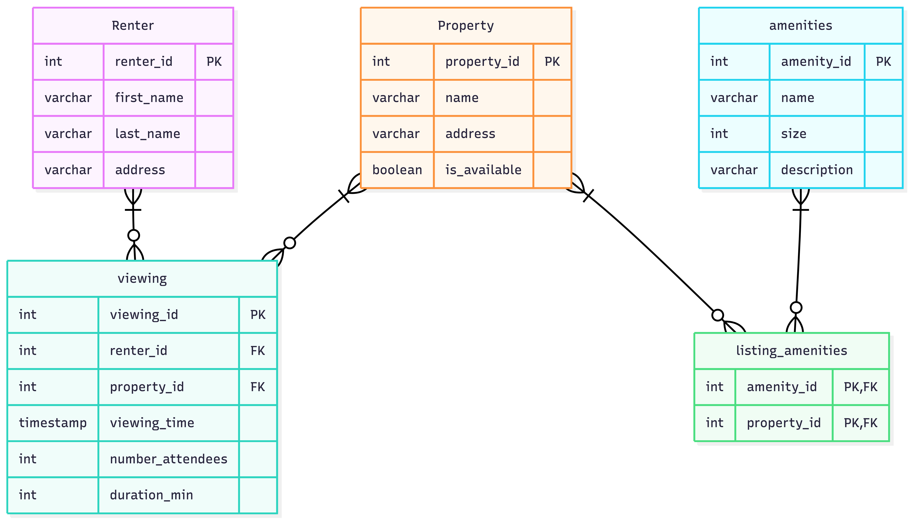

# EX603 Rental Marketplace Database

Rental Data Base that models Renters, Properties, Amenities, Viewings, and the amenities associated with rental properties. 

##Domain

This project will provide a system where information about Renters and Properties can be managed.  It will allow users to search what Renters has viewied a specefic property, and what renters have seen a specific property, and how long the viewing lasted.  It will also allow to record and search all information related to each propertie's ammenities, like pool, air conditioning, parking space.

## Entity Relational Diagram

