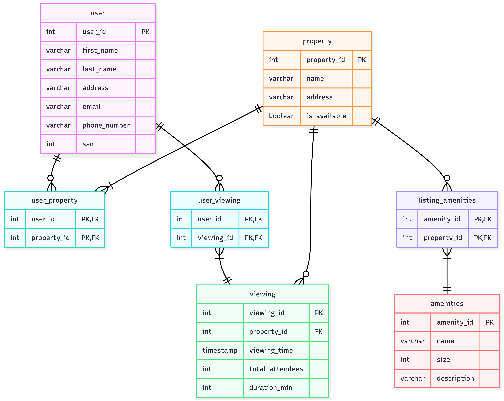

# EX603 Rental Marketplace Database

Rental Data Base that models Renters, Properties, Amenities, Viewings, and the amenities associated with rental properties. 

## Domain

This project will provide a system where information about Renters and Properties can be managed.  It will allow users to search what Renters has viewied a specefic property, and what renters have seen a specific property, and how long the viewing lasted.  It will also allow to record and search all information related to each propertie's ammenities, like pool, air conditioning, parking space.

## Entity Relationship Diagram

## Schema

The database consists of seven tables that represent users, properties, amenities, property viewings, and the relationships between them.

- `users` stores information about people using the system. A user can participate as a renter, an owner, or both.
`property` stores the properties available in the system.
- `user_property` is a junction table that represents the ownership relationship between users and properties.
- `amenities` stores the different amenities that can be associated with properties.
- `viewing` represents scheduled property viewings. Each viewing is associated with one property.
- `user_viewing` is a junction table that represents which users participate in particular viewings.
- `listing_amenities` is a junction table that associates properties with their amenities.

### Design Decisions

The original design represented renters and owners separately. As the design became more detailed, these were consolidated into a single `users` table to avoid duplicating information for a person who can participate in both roles.

The `user_property` junction table supports a many-to-many relationship between users and properties. A user can own multiple properties, while a property can have multiple owners.

The `user_viewing` junction table records multiple users attending a viewing and allows a user to be in multiple viewings. The `viewing` table remains a separate entity because each viewing has its own time, duration, attendance information, and associated property.

The `listing_amenities` table represents the many-to-many relationship between properties and amenities, allowing a property to have multiple amenities and the same type of amenity to be associated with multiple properties.
